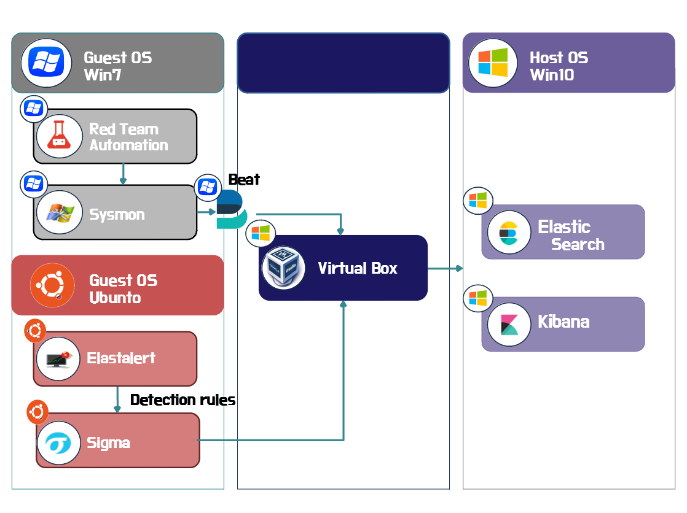

# Intelligent Incident Response Platform

## Index

* [Diagram](#diagram)
* [Infrastructure](#infrastructure)
* [How to install](#how-to-install)
* [Systematization](#getting-started)
* [Manual](#manual)
* [Troble Shooting](#troble-shooting)
* [Reference](#reference)

## [Diagram](#index)

   

## [Infrastructure](#index)

* **HOST**

|Name|Version|Remark|
|-|-|-|
|Elasticsearch|7.12.1|-|
|Kibana|7.12.1|-|

* **Guest 1 (Windows 7 Ult) - 32bit**
 
|Name|Version|Remark|
|-|-|-|
|Python|2.7|32 bit|
|Winlogbeat|7.12.1|-|
|Sysmon|13.10|-|
|RTA|-|-|

* **Guest 2 (Ubuntu 18.04) - 64bit**

|Name|Version|Remark|
|-|-|-|
|Python|3.6.9|64 bit|
|Elastalert|0.2.4|-|


## [How to install](#index)

* **HOST**
	+ Elasticsearch download
		> https://www.elastic.co/kr/downloads/past-releases#elasticsearch

	+ Kibana download
		> https://www.elastic.co/kr/downloads/past-releases#kibana

	+ Elasticsearch 압축 해제 후 해당 디렉토리의 bin 폴더의 elasticsearch.bat으로 구동
		> 기본주소 : http://127.0.0.1:9200
		> 
		> 네트워크 정보(포트 및 IP) 를 변경하려면 config\elasticsearch.yml 참조

	+ Kibana 압축 해제 후 해당 디렉토리의 bin 폴더의 kibana.bat으로 구동
		> 기본주소 : http://127.0.0.1:5601
		> 
		> 네트워크 정보(포트 및 IP) 를 변경하려면 config\kibana.yml 참조
		
* **Guest 1 (Windows)**
	+ Sysmon download
		> https://docs.microsoft.com/en-us/sysinternals/downloads/sysmon
	
	+ RTA download
		> https://github.com/endgameinc/RTA
	
	+ Winlogbeat download
		> https://www.elastic.co/kr/downloads/past-releases/#winlogbeat

* **Guest 2 (ubuntu)**

	<details>
  	<summary>[Yelp의 elastalert]</summary>
  	<div markdown="1">
   	 > https://github.com/Yelp/elastalert
  	</div>
	</details>

  - elastalert install

    > https://elastalert.readthedocs.io/en/latest/running_elastalert.html


##  [Getting Started](#index)

* Kibana 실행 (관리자 계정 권장)
  > bin/kibana.bat

* Elasticsearch 실행 (관리자 계정 권장)
  > bin/elasticsearch.bat

* Win7sp1 sysmon vm 환경에서 sysmon 서비스 실행(관리자 계정)
  > sysmon.exe -i sysmon-config.xml
    (기존에 설치했다면 필요 없음)

* Win7sp1 sysmon vm 환경에서 winlogbeat 실행(관리자 계정)
  > winlogbeat.exe -c winlogbeat.yml

* Ubuntu 18.04 64bit 환경에서 Elasticalert 실행
  >/elastalert  
  >elastalert --verbose --start  --config <config.yaml> --rule <error.yaml>
 
* [Guest 2]

```ubuntu
pip3 install elastalert
```

Some Markdown text with <span style="color:blue">some *blue* text</span>.
```ubuntu
python3 -m pip install -U pip
```
 
 
## [Manual](#index)

* **sysmon**
  > https://github.com/trustedsec/SysmonCommunityGuide/blob/master/Sysmon.md

* **elastic**
  > https://www.elastic.co/guide/en/elastic-stack-get-started/7.6/get-started-elastic-stack.html#install-elasticsearch

* **elastalert**
  > https://elastalert.readthedocs.io/en/latest/running_elastalert.html
  
 ## [Troble Shooting](#index)
 [[ windows 7 ]]
 * sysmon 10.x 실행 오류
   > kb2533623 설치 (wevtapi.dll 문제)
   
   > kb3033929 설치

* sysmon-config.xml

  **변경전** 
     
    > \<PipeEvent onmatch="exclude"\>
	
    > \<EVENTID condition="is"\>1\</EVENTID\> 
     
    > \<\/PipeEvent\>
          
   **변경후**   
   
     > \<PipeEvent onmatch="include"\>
			
     >**삭제**
	
     > \</PipeEvent\>
          
   **변경전**
   
     > \<WmiEvent onmatch="include"\>
		
     >    \<Operation condition="is">Created</Operation\> 
            
     > \</WmiEvent\>
           
   **변경후**     
   
     > \<WmiEvent onmatch="include"\>
	
     > **삭제** 
	
     > \</WmiEvent\>
        
[[ Elasticsearch ]] 
* network.host 설정 bootstrap checks failed
  > https://soye0n.tistory.com/178


[[ Elastalert ]]
* pip install 오류
  > python version 3.6 다운

## [Reference](#index)
* Open Source Endpoint monitoring 
  - https://github.com/DearBytes/Opensource-Endpoint-Monitoring 

## Contributors
* maxup37
* idk3669
* air83
